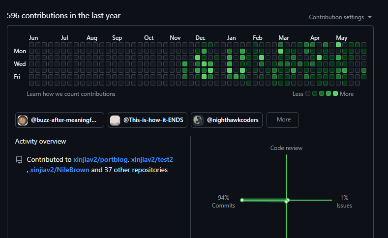
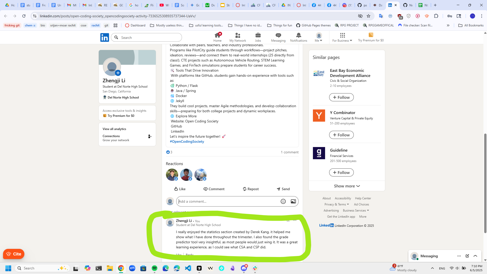
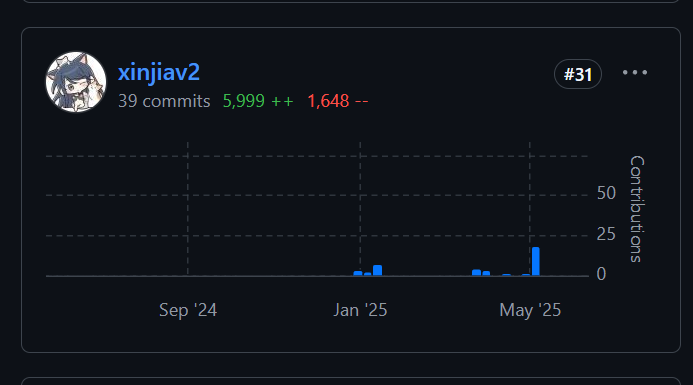

Hello! This is the documentation for Tri 3. <br>
Throughout this trimester I have worked on multipule things, for example: <br>
 - Two Player System <br>
 - APIs Including API adaption and API creation <br>
 - Lead Documenter - very ironic considering that I am not using tailwind for this documentation. <br>
 - Experimentation <br>
 - Developing our Platformer Game Engine <br>
 - Developing our own custom enemy system <br>

I have also included many other things that were not explicitly mentioned, however were done last trimester. Examples include: <br>
 - N@tM Feedback <br>
 - Reflections and Next Steps <br>
 - Tinkers (kinda...) <br>

# Two Player System: <br>
 - For our two player system, I modified the `Player.js` file to allow for two players to control the same character. 
 - I modified the `GameLevelEnd.js` file to allow for two players to control the same character. <br>
### Example Code: <br>
```javascript
keypress: { up: 87, left: 65, down: 83, right: 68 }
```
<br>
 - The following code was for setting the keys to move the player within the file `GameLevelEnd.js` <br>
 - I also modified the `Player.js` file to allow for two characters within one file. <br>

# APIs: <br>
 - During our APIs time period, I primarily focused on creating the notebooks.<br>
 - While developing the notebooks, I also worked on hack assignments and homework.<br>
 - For the homework assignment involving a currency conversion API, I created an answer key.<br>
 - We taught local storage alongside APIs.<br>
 - I implemented a local storage section in both the answer key and the homework.<br>
### Example Code:
```javascript
localStorage.setItem("key", "value");
```
<br>
 - The above code was for setting a key to a value within the file <br>

# Documentation: <br>
 - I created this documentation for notebooks we did for our teaching <br>
 - Me and Nikhil were responsible for creating documetation, he created the documetation for what we did and I made documentation for notebooks. <br>
 - Since I was in charge of notebook documentation I did a unique take on tailwind and for our frontmatter I made a review exercise intead of a infographic
[Documentation for APIs and Local Storage](https://nighthawkcoders.github.io/portfolio_2025/csse/2025/04/24/CSSENOTEBOOKSDOCUMENTATION.html)

# Experimentaiton: <br>
 - Me and Evan worked on a experiment where we created a game that was similar to the hacks that were assigned on monday <br>
 - We created a platformer game with a health system. <br>
 - We are also planning on modifying the code for the hacks assigned on monday <br>

# Platformer Game Engine: <br>
 - Our platformer game engine was mostly developed by me and Evan. <br>
 - This engine was comprised of a new subdirectory within the adventureGame file known as adPlatEngine. <br>
 - Within this subdirectory me and evan have created a html file which serves as the page you go to in order to access the platformer <br>
 - This subdirectory includes an entire new engine and game systems. <br>
 - This one subdirectory singlehandly contained 90% of our efforts throughout the trimester, and was overall just a pain to create, however with the results that we have gotten yesterday at N@tM it was entirely worth it. <br>

# Enemy System: <br>
 - I know, this is very repetitive. <br>
 - I believe we had 5 different enemy lessons, however ours were very unique. <br>
 - Our enemy was very different than any other enemy we had a lesson on due to our enemy not following a set path, and instead tracking the player. <br>
 - We mostly used the distance formula to track the nearest player and draw a line to them, the enemy will follow that line. <br>

# Other Things Not Explicitly Mentioned However Were Done Last Trimester: <br>

# N@tM Feedback: <br>
 - This time, for N@tM, we had a really good game to show off, and it was not overshadowed by Evan and West's game. Well technically it is but now its both mine and Evan's game (as well as everyone else that worked on it in our group.) <br>
 - Instead of Srijan Atti, I got advice from a freshman, that was more blunt about what we should have done and what we shouldnt. <br>
 - We asked Preston Poon, and he gave us some advice that were actually similar to what Srijan said last trimester. <br>
 - Unfortunetly, he didn't praise us as much as Srijan did. Preston mostly focused on the technical aspects, such as how there ISIN'T A INSTRUCTIONS PAGE, WHICH WAS SOMETHING SRIJAN TOLD US TO ADD LAST TRIMESTER 😭😭😭 I'M SELLING. <br>
 - Preston also told us that he didn't find the jump system very smooth, part of our platformer. This is something that we took importance in, as we didn't use Mort's so we couldn't blame someone else. <br>
 - He gave us another aspect to take into consideration, such as "maybe more platformer levels or make it more difficult the more pearls you collect" <br>

# Tinkers! (or really, just 5 key things we learned): <br>
 - I do not really know why I put this here as I already explained what I did, which was basically my tinkers, such as our game engine? tinker. Our enemy? tinker.<br>
 - So I instead focused on what we learned!<br>
 - My first Key Thing (Following the format of last trimesters) is my github commits. <br>
 - Last trimester I ended with 376 commits, and this trimester I had... <br>
 
 - 596. This includes the one from last trimester, so I definetly did a little less, however now my commits were much bigger. <br>
 - Item 2! <br>
 - Last trimester we learned how to use github, and just the basics. This trimester we learned how to apply the github skills we used to do great things. Well great things being making around a pr to portfolio_2025/pages... <br>
 - We learned to apply our github skills, to make organizations, as well as to make a very pretty color board full of our schedule :D <br>
 - Item 3! <br>
 - Item three is usually teaching. What have we taught? <br>
 - We mostly focused on teaching the more "niche" items that other people didnt teach, for example, API's, Two Player, Tracking Enemy. <br>
 - Item 4! <br>
 - We learned work ethics, communication skills, and overally very improtant things that just help you become a better person. <br>
 - Item 5! <br>
 - We learned a small list of words, quite a small list of words. More will be explained on these words later... <br>

# That small list of words we learned: <br>
> Ok... What were this "list of small words" that we have learned...?

This small list of words were quite indeed a small list of words..? <br>

Here it is!<br>

***Programming Concepts and Definitions***<br>
**Software Engineering Practices**<br>
*Planning changes* - Systematically analyzing and documenting modifications before implementation<br>
*Checklists* - Standardized lists of tasks or requirements to ensure consistency and completeness<br>
*Burndowns* - Visual charts tracking work completion over time in project management<br>
*Coding with comments* - Writing explanatory text within code to document functionality and purpose<br>
*Building help documentation* - Creating user guides and technical documentation for software systems<br>
**Software Development Lifecycle Practices**<br>
*Source control* - Version management systems that track changes to code over time<br>
*Forking* - Creating an independent copy of a repository to develop separately<br>
*Branching* - Creating parallel development paths within a repository<br>
*Building* - Compiling and assembling source code into executable applications<br>
*Testing and verification* - Validating that software functions correctly and meets requirements<br>
*Pull requests* - Formal requests to merge code changes from one branch to another<br>
*Merging/integrating* - Combining code changes from different branches or contributors<br>
*Deployment* - Publishing and installing software to production environments<br>
**Retrospective Engineering Practices**<br>
*Presentation* - Formal demonstration of completed work to stakeholders<br>
*Live reviews* - Real-time examination and discussion of code or systems<br>
*Demos* - Interactive demonstrations of software functionality<br>
*Code reviews* - Systematic examination of source code by peers for quality assurance<br>
*Revising plans* - Updating project plans based on lessons learned and new requirements<br>
**Data Types**<br>
*Numbers* - Numeric values including integers and floating-point numbers<br>
*Strings* - Text data represented as sequences of characters<br>
*Booleans* - True/false logical values<br>
*Arrays* - Ordered collections of elements accessible by index<br>
*JSON objects* - Data structures using JavaScript Object Notation for key-value pairs<br>
**Operators**<br>
*String operations* - Functions for manipulating text (concatenation, substring, search)<br>
*Mathematical operations* - Arithmetic functions like addition, subtraction, multiplication, division<br>
*Boolean expressions* - Logical operations using AND, OR, NOT to evaluate true/false conditions<br>
**Control Structures**<br>
*Iteration* - Repeating code execution using loops (for, while, do-while)<br>
*Conditions* - Executing code based on true/false evaluations (if/else statements)<br>
*Nested conditions* - Conditional statements placed inside other conditional statements<br>
**Input/Output**<br>
*HTML5 input* - Web form elements for user data entry<br>
*Validation* - Checking user input for correctness and security<br>
*Key events* - Responding to keyboard interactions in applications<br>
*Document Object Model (DOM)* - Programming interface for HTML/XML documents<br>
**Classes**<br>
*Writing classes* - Defining blueprints for objects with properties and methods<br>
*Creating methods* - Writing functions that belong to a class<br>
*Instantiating objects* - Creating specific instances of a class<br>
*Using objects* - Accessing and manipulating object properties and methods<br>
*Calling methods* - Executing functions defined within an object<br>
*Parameters* - Input values passed to functions or methods<br>
*Return values* - Output values returned by functions or methods<br>
**Coding Practices**<br>
*SRP* - Single Responsibility Principle: each class should have one reason to change<br>
*Object Literal* - Creating objects using curly brace notation with key-value pairs<br>
*Object Instance* - A specific occurrence of a class with its own property values<br>
*FSMs in Game* - Finite State Machines used to manage game states and transitions<br>
*Inheritance* - Mechanism allowing classes to inherit properties and methods from parent classes<br>

Wow, I actually used good grammar for once when writing this...<br>

# Reflection and Next Steps <br>
It is sad to see this class end. Overall this class was a really fun class, we learned a lot, we did a lot, and all our contributions eventually came through. <br>
These are some things that I remember we did last trimester: <br>
Future Applications of This Class:<br>
 - Can help in a potential computer science career.<br>
 - Beneficial for any career requiring collaboration with coworkers.<br>
Personal Growth:<br>
 - Learned to reflect on mistakes.<br>
 - Developed perseverance through challenges.<br>
 - Realized that goals can be achieved by taking one step at a time. <br>

Now I believe there is one last thing... Self Grading... <br>

### For my self grading I would give myself a 91% <br>
 - This is due to a variety of reasons, most of which are based off of the effort levels that I have maintained, as well as our end result. <br>
 - For example, I was one of the main editors of the repository, and was responsible for making most of the new ideas and integrating most of the new updates, as well as Evan. <br>
 - Often times whenever our code didn't work, I also spent a lot of time debugging what went wrong, this made it so that I often times knew what error was going on before even looking at the console! <br>
 - I spent a decent amount of time working outside of class hours, for example the platformer engine was developed by me and Evan outside of school hours. <br>

# Thank you for making this class amazing! Period 4 will always be memorable due to the amazing classes I had in P4 :D <br>

Unfortunatly my login was disabled to find my statistics including with the grade calculator due to the backend breaking (and a 401 error even while providing correct password) <br>
here's proof: <br>  <br>
However, I have already tested the grade calculator and viewed the dashboard, I don't have screenshots for this, however my N@tM comment was on this. (also derek kang showed me this so you can also ask him) <br>  <br>
Sorry for the inconvienence! I hope this works just as well. <br>
Here is also my contributions to nighthawkcoders just for refrence: <br>
